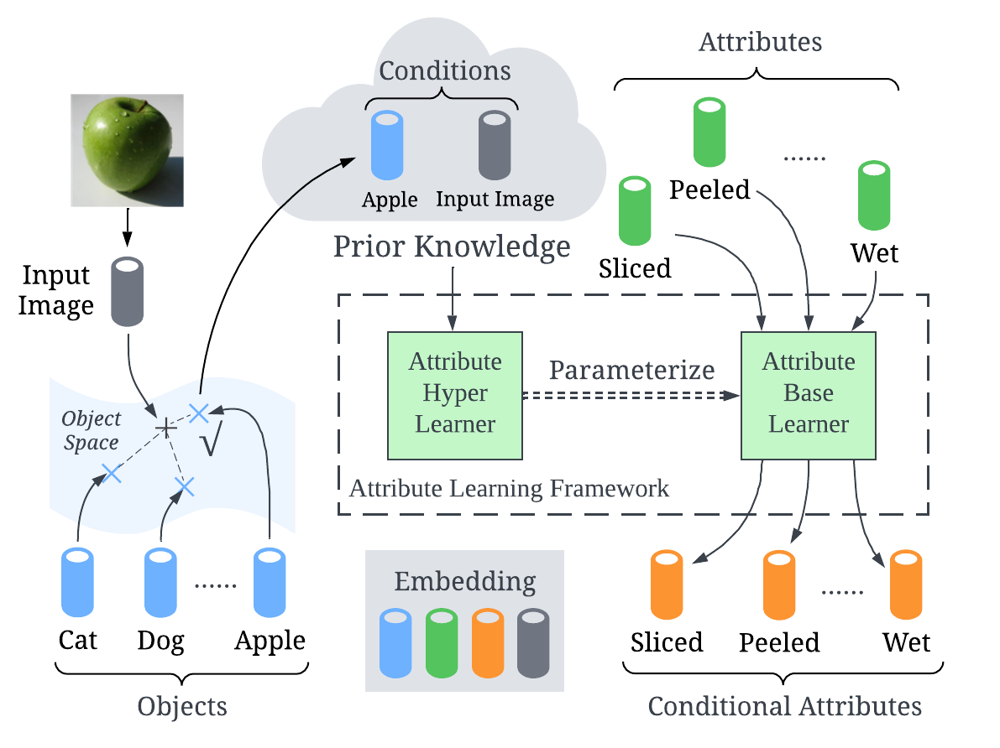
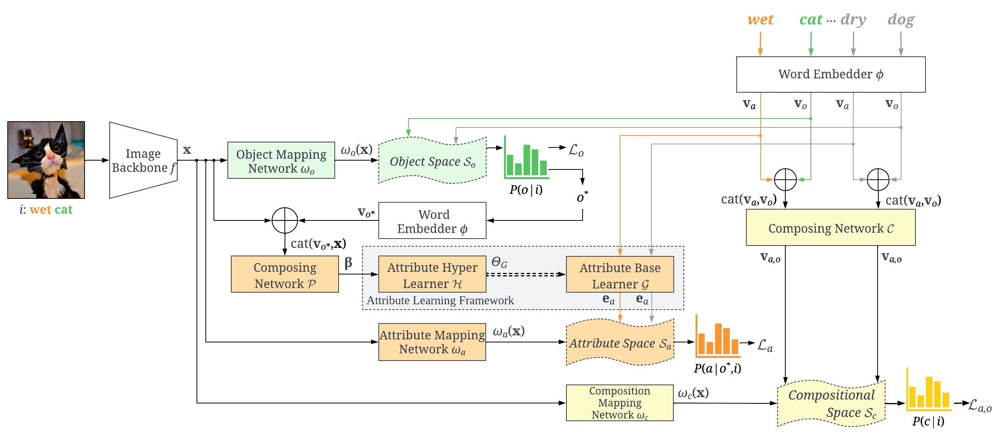
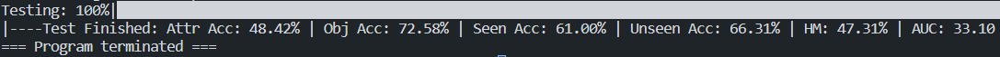
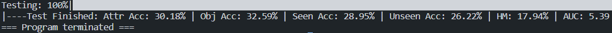
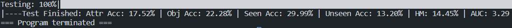

## Update for SCHOLA

### 1. Environment

Create a new environment `czsl_canet` from [`environment.yml`](environment.yml):

```
conda env create -f environment.yml
conda activate czsl_canet
```

### 2. Data Preparation

1. Create directory `CANet-CZSL/data_dir/vg/`.
2. Download the images of Visual Genome (VG) at [Part 1](https://cs.stanford.edu/people/rak248/VG_100K_2/images.zip) and [Part 2](https://cs.stanford.edu/people/rak248/VG_100K_2/images2.zip). Unzip and place all images in `CANet-CZSL/data_dir/vg/images/images/` (double `images` to follow the data format of `dataset`/`label`/`image.jpg`).
3. Download VG attributes [here](https://homes.cs.washington.edu/~ranjay/visualgenome/data/dataset/attributes.json.zip). Unzip and place `attributes.json` file in `CANet-CZSL/data_dir/vg/`.
4. Download FastText word embeddings [here](https://dl.fbaipublicfiles.com/fasttext/vectors-crawl/cc.en.300.bin.gz). Unzip and place `cc.en.300.bin` file in `CANet-CZSL/data_dir/fasttext/`.
5. Download Word2Vec word embeddings [here](https://drive.google.com/file/d/0B7XkCwpI5KDYNlNUTTlSS21pQmM/edit?usp=sharing) (Google Drive link). Unzip and place `GoogleNews-vectors-negative300.bin` file in `CANet-CZSL/data_dir/word2vec/`.
6. Download ND-VG150 data splits [here](https://drive.google.com/file/d/1gU9nFEMcDQWx3WvkHygeH303u6kBuJ3S/view) (Google Drive link). Unzip and place `vg_naturaldisasters/` folder in `CANet-CZSL/data_dir/vg/`.

After the above 6 steps, the directory structure should be as follows:

    ```python
    > CANet-CZSL
      > data_dir
        > vg
          > images
            > images
              - 2335866.jpg
              - ...
          > vg_naturaldisasters
            - rel.json
            - test.json
            - train.json
            - unused_images.txt
            - val.json
          - attributes.json
        > fasttext
          - cc.en.300.bin
        > word2vec
          - GoogleNews-vectors-negative300.bin
    ```

7. Execute [`generate_data.py`](generate_data.py) to generate `CANet-CZSL/data_dir/vg/metadata_compositional-split-natural.t7` necessary for training the model. This file contains mappings between the images, object labels, and attribute labels.

```
python generate_data.py
```

### 3. Train model

Simply execute [`train.py`](train.py).

```
python train.py
```

---

# Conditional Attribute Network CANet

This is the pytorch code for the paper:

> **Title:** Learning Conditional Attributes for Compositional Zero-Shot Learning<br> > **Authors:** Qingsheng Wang, Lingqiao Liu, Chenchen Jing, et.al.<br> > **Publication:** IEEE Conference on Computer Vision and Pattern Recognition (CVPR) 2023<br> > **Published Paper:** https://arxiv.org/abs/2305.17940

<p>

</p>

<p>

</p>

If you find this work interesting please cite

```
@inproceedings{wang2023learning,
  title={Learning Conditional Attributes for Compositional Zero-Shot Learning},
  author={Qingsheng Wang, Lingqiao Liu, Chenchen Jing, Hao Chen, Guoqiang Liang, Peng Wang, Chunhua Shen},
  booktitle={CVPR},
  year={2023}
}
```

All code was implemented using Python 3.10 and Pytorch 1.12 on Ubuntu.

## 1. Data Preparation

UT-Zappos50K: <http://vision.cs.utexas.edu/projects/finegrained/utzap50k/ut-zap50k-images.zip>

MIT-States: <http://wednesday.csail.mit.edu/joseph_result/state_and_transformation/release_dataset.zip>

C-GQA: <https://s3.mlcloud.uni-tuebingen.de/czsl/cgqa-updated.zip>

1. Download datasets UT-Zappos50K, MIT-States, and C-GQA and unzip them into a dataset folder, e.g., /home/XXX/datasets. Rename the dataset folder names as **ut-zap50k**, **mit-states**, and **cgqa**.
2. Download data splits for UT-Zappos50K and MIT-States at <https://www.senthilpurushwalkam.com/publication/compositional/compositional_split_natural.tar.gz>
3. Unzip the downloaded file **compositional_split_natural.tar.gz** and place the sub-folders **mit-states** and **ut-zap50k** into the corresponding dataset folder. Note that the cgqa dataset zip file contains its own data split.
4. Now, we have the following folder structure for the three datasets:

   ```python
   > /home/XXX
     > datasets
       > ut-zap50k # can also be mit-states or cgqa
       - metadata_compositional-split-natural.t7
       > compositional-split-natural
           - test_pairs.txt
           - train_pairs.txt
           - val_pairs.txt
       # ===Create this empty folder manually for UT-Zappos50K===#
       > images
       # ======Only UT-Zappos50K has the following folders=======#
       > Boots
       > Sandals
       > Shoes
       > Slippers
   ```

5. Run **/utils/reorganize_utzap.py** to reorganize images in UT-Zappos50K, where set **DATA_FOLDER='/home/XXX/datasets'** in line 20.
6. (Optional) Delete sub-folders **Boots**, **Sandals**, **Shoes**, and **Slippers** in the folder **ut-zap50k** if you want to save some disk space.

## 2. Inference

We provide the trained parameters for all three datasets:

Google Drive: <https://drive.google.com/drive/folders/1IGXPMRossFuVxIeWzvKRXrczXDNhHG1F?usp=sharing>

Baidu Netdisk: <https://pan.baidu.com/s/1D3BaNKgTjy7dxI8fvcbbDA?pwd=2ity>

1. Download all trained parameters into the manually created folder **saved model**. Now we have the folder structure:

   ```
   > CANet-CZSL-master
     > ...
     > model
     > saved model
       - saved_cgqa.t7
       - saved_mit-states.t7
       - saved_ut-zap50k.t7
     > utils
     > ...
   ```

2. Open **test.py**, you have to specify some arguments before running this code: **args.dataset**, **args.data_root**, and **device** in lines 18-21.
3. Run this code. If you run the code for the first time, you will get a file **resnet18_feature_vectors.t7** in each dataset folder. This file contains visual embeddings of all images extracted by resnet-18 without any image augmentation. In this way, all visual embeddings are retrieved by image filename rather than being computed every time and thus reducing inference time significantly. You will get exactly the same results reported in the paper if everything sets (Results in the paper are rounded).

   UT-Zappos50K:
   <p>
   
   </p>

   MIT-States:
   <p>
   
   </p>

   C-GQA:
   <p>
   
   </p>

_Warning: If you were using an older version pytorch, you would get slightly different results because the pre-trained parameters of the image backbone are different from the lasted version pytorch._

## 3. Training

You can train the model from scratch.

1. You can edit configurations for different runs in **flags.py** and **configs/dataset name
   CANet.yml**. The file **flags.py** defines some of the shared hyper-parameters and the \*.yml files define dataset-specific hyper-parameters.

2. Open **model/word_embedding.py** and set the global variable **DATA_FOLDER = '/home/XXX/word_embedding/'** in line 4 to tell where you save these pre-trained word embeddings.

3. Open **train.py** and set **args.dataset**, **args.data_root**, and **device** in lines 34-37 before your training.

You will notice that a folder named **logs** is created automatically after starting the training. This folder contains the saved checkpoint model, best model, tensorboard file, and all history results in a csv file.

## Acknowledgement

This code package is based on the CZSL library at <https://github.com/ExplainableML/czsl>. We show our deep appreciation for their contribution.
